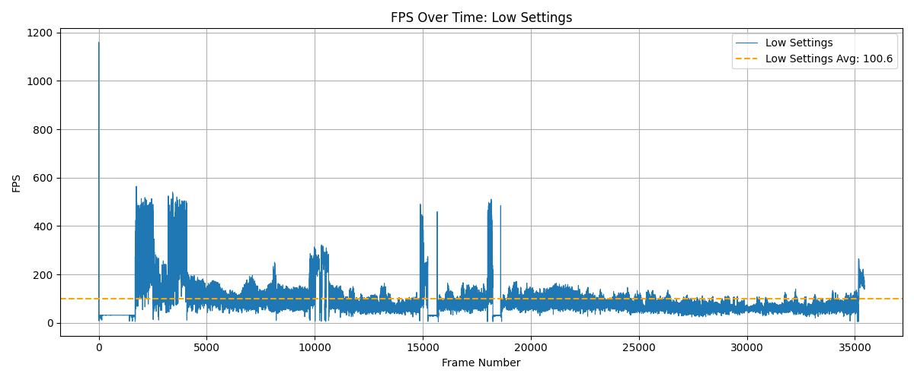
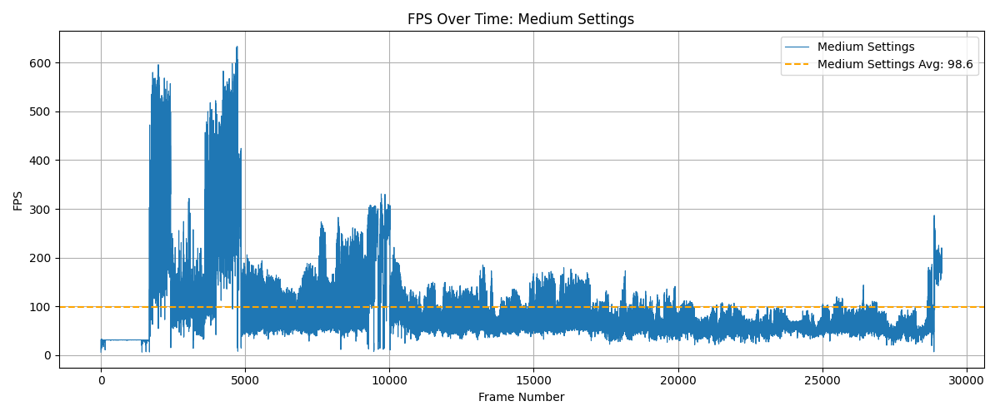
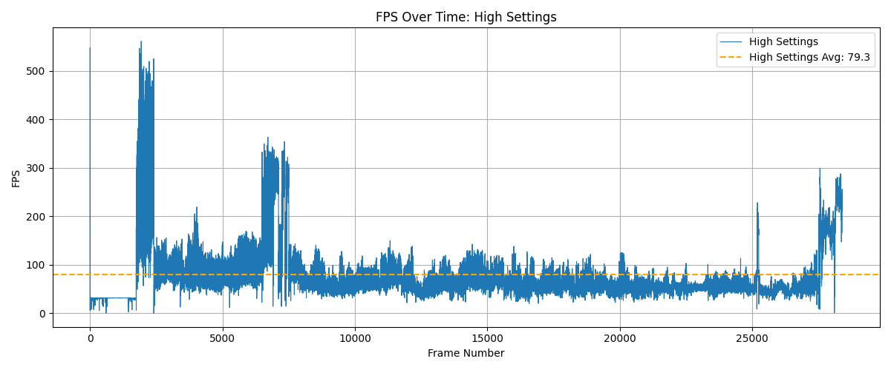
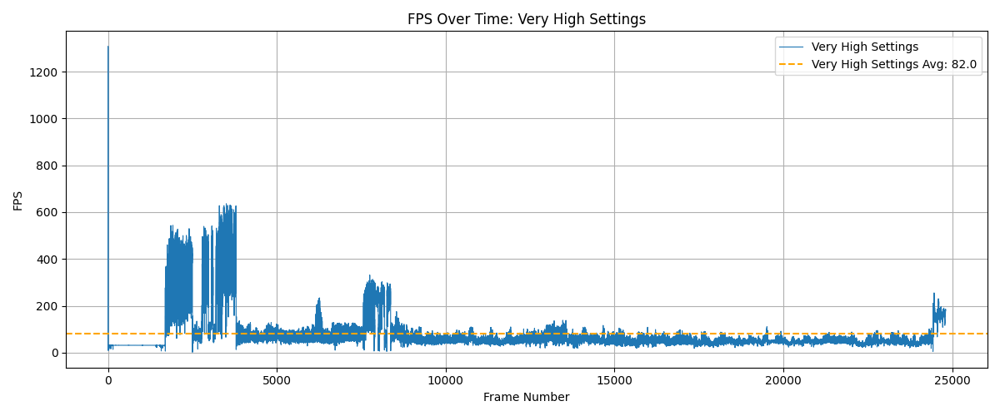

Performance Report: Just Cause 3 - All Settings

Game: Just Cause 3  
Settings: Low, Medium, High, Very High  
Duration: Approximately 15 minutes per setting  
Platform: Windows 10 ARM, Ryzen 7 5800HS, GTX 1650, 16GB RAM  
Logging Tool: PresentMon  
Overlay: MSI Afterburner (RTSS)

Performance Metrics:

| Setting           | Avg FPS | 1% Low | 0.1% Low |
|-------------------|---------|--------|----------|
| Low Settings       |  100.61 |  29.81 |    11.24 |
| Medium Settings    |   98.62 |  30.52 |    15.04 |
| High Settings      |   79.25 |  29.69 |    13.81 |
| Very High Settings |   82.05 |  28.05 |    13.78 |

Graphs:  
- Low Settings:   
- Medium Settings:   
- High Settings:   
- Very High Settings: 

Observations:  
Low and Medium settings provided high frame rates but showed minimal visual fidelity.  
High and Very High settings resulted in slightly reduced FPS but offered richer visuals.  
Minor frame pacing inconsistencies were observed during large explosions and heavy physics simulations.  
GPU temperatures remained within safe operating limits.  
No crashes or bugs encountered during any of the test sessions.

Conclusion:  
Just Cause 3 runs well across all settings on the test configuration. High and Very High settings provide a good balance between performance and visual quality. Recommended to play on High for best overall experience without compromising responsiveness.
