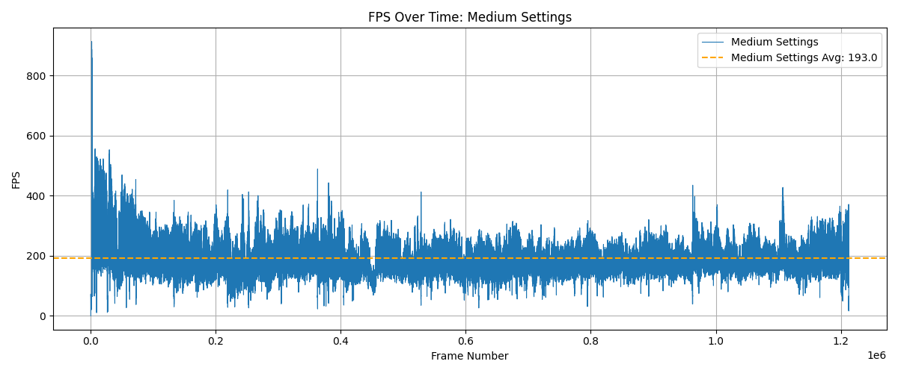

Performance Report: Serious Sam Fusion 2017
----------------------------------------------

Platform: Steam  
Settings Tested: Medium  
Test System: Ryzen 7 5800HS, GTX 1650, 16GB RAM  
Tools Used: PresentMon v2.3.1, MSI Afterburner  
Date: 2025-06-30  

---

 FPS Metrics Summary
----------------------

| Setting           | Avg FPS | 1% Low | 0.1% Low |
|-------------------|---------|--------|----------|
| Medium Settings   | 192.96  | 109.85 | 65.94    |

---

 FPS Over Time

---

 Test Details

- Session Length: Approximately 110 minutes  
- Test Scenario: Full gameplay session from start to finish  
- Crashes Observed: None  
- Performance Stability: High. Framerate remained well above 100 FPS throughout.  
- Observations:  
  - Minor dips observed in the 0.1% low range, likely due to scene transitions or scripted events  
  - No significant stuttering or input delay noted  
  - GPU and CPU usage remained consistent with expected behavior for this hardware

---

 Summary

The game runs extremely well at medium settings on a GTX 1650-powered system. With an average FPS near 193 and strong 1%/0.1% lows, Serious Sam Fusion 2017 is fully playable and visually smooth for extended sessions under this configuration.
